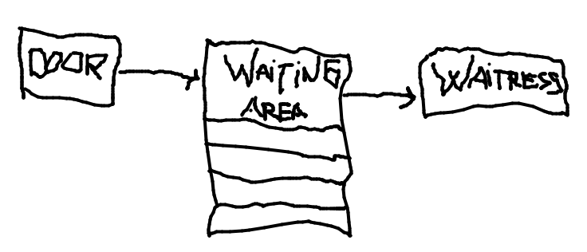

## OpSys-TDT4186
### Praktisk Øving 1  
#### Implementation
The SushiBar is implemented in a *Producer-Consumer pattern*.  
The Door is the *producer*  and the Waitresses are the *consumers*.
The WaitingArea is the common *Queue*.  
(See amazing picture below)

The doors run method pushes new customers into the waitingArea queue if the queue is not full.  
To achieve this waitingAreas method `enter(Customer)` is *synchronized* on waitingArea.  
If the queue is full the current thread has to *wait*.  
   
The waitresses pops customers out of the queue if the queue is not empty.  
If the queue is empty the current thread has to *wait* in the same manner as the producer/door.

The two methods `enter(Customer)` and `next()` in *WaitingArea* are used to add and pop customers from the queue.  
It is in these methods the waiting threads are *notified* of the change and `wait()` is called.

In *SushiBar* the threads are initiated and the consumer threads are stopped.  
The producer thread stops on its own when the `isOpen` variable is turned to false.

##### Wait()
The `wait()` method causes the thread to wait until notified.  
The`wait()` method can be seen in WatingAreas `next()` and `enter(Customer)` method.

##### Notify()
The `notify()` method wakes up one random thread waiting for this object to become available.  
`notify()` is found in waitingAreas *enter()* method.

##### NotifyAll()
Similar to `notify()` but wakes up all threads waiting for this object to become available.  
`notifyAll()` is found in waitingAreas `next()` method.

##### Shared variables
WaitingArea is the shared queue. They are managed in the manner explained above.

##### Final statistics
The final statistics is written by the SushiBars `main()` method after all threads have terminated naturally using the `.join()` method on the consumers.
